# 📈 Stock Portfolio Analysis Agent

An intelligent stock portfolio analysis agent built with **Composio Tool Router**, **OpenAI GPT-4o-mini**, and **yFinance**. The agent analyzes hypothetical investment opportunities, tracks stock performance, simulates portfolio allocations, and generates AI-powered bull/bear insights.

## 🎥 Live Demo (CLI in Action)


## ✨ Features

- 🗣️ **Natural Language Queries** - Ask investment questions in plain English
- 📊 **Historical Stock Data** - Fetch up to 4 years of stock data via yFinance
- 💰 **Portfolio Simulation** - Single-shot or DCA (Dollar-Cost Averaging) strategies
- 📈 **Performance Metrics** - Calculate returns, allocations, and total value
- 📉 **S&P 500 Benchmark** - Compare your portfolio against SPY
- 🐂🐻 **AI Insights** - Generate bull (positive) and bear (risk) analysis
- 🖥️ **Interactive CLI** - Beautiful terminal interface built with Textual
- 🌐 **REST API** - FastAPI backend with real-time SSE streaming

---

## 🏗️ Architecture

```mermaid
flowchart TB
    subgraph User["👤 User Interface"]
        CLI["🖥️ CLI (Textual App)"]
        API["🌐 REST API (FastAPI)"]
    end

    subgraph Agent["🤖 Agent Layer"]
        Orchestrator["Agent Orchestrator"]
        PortfolioAgent["Portfolio Analysis Agent"]
        InsightsAgent["Insights Generator Agent"]
    end

    subgraph Composio["🔧 Composio Tool Router"]
        ToolRouter["Tool Router"]
        FetchStock["fetch_stock_data"]
        FetchBenchmark["fetch_benchmark_data"]
        SimulatePortfolio["simulate_portfolio"]
        SimulateSPY["simulate_spy_investment"]
        CalcMetrics["calculate_metrics"]
    end

    subgraph External["🌍 External Services"]
        OpenAI["OpenAI API\n(GPT-4o-mini)"]
        YFinance["yFinance API\n(Yahoo Finance)"]
    end

    subgraph Data["💾 Data Layer"]
        Session["Session Manager"]
        Portfolio["Portfolio Manager"]
        Models["Pydantic Models"]
    end

    CLI --> Orchestrator
    API --> Orchestrator
    
    Orchestrator --> PortfolioAgent
    Orchestrator --> InsightsAgent
    
    PortfolioAgent --> ToolRouter
    InsightsAgent --> OpenAI
    
    ToolRouter --> FetchStock
    ToolRouter --> FetchBenchmark
    ToolRouter --> SimulatePortfolio
    ToolRouter --> SimulateSPY
    ToolRouter --> CalcMetrics
    
    FetchStock --> YFinance
    FetchBenchmark --> YFinance
    
    PortfolioAgent --> OpenAI
    
    Orchestrator --> Session
    Session --> Portfolio
    Portfolio --> Models
```




[](https://x.com/sailorworks)


## 🚀 Setup

### Prerequisites

- Python 3.11+
- [uv](https://docs.astral.sh/uv/) (Python package manager)

### 1. Clone the Repository

```bash
git clone https://github.com/your-username/stock-portfolio-analysis-agent.git
cd stock-portfolio-analysis-agent
```

### 2. Create Virtual Environment

```bash
uv venv
source .venv/bin/activate  # On macOS/Linux
# or
.venv\Scripts\activate     # On Windows
```

### 3. Install Dependencies

```bash
uv sync
```

### 4. Configure API Keys

Copy the example environment file and add your API keys:

```bash
cp .env.example .env
```

Edit `.env` and add your keys:

```env
# Composio API Key - Get from https://platform.composio.dev
COMPOSIO_API_KEY=your_composio_api_key_here

# OpenAI API Key - Get from https://platform.openai.com
OPENAI_API_KEY=your_openai_api_key_here

# Server Configuration (optional)
HOST=0.0.0.0
PORT=8000
RELOAD=false
WORKERS=1

# Logging Configuration (optional)
LOG_LEVEL=INFO
```

---

## 🔑 Getting API Keys

### Composio API Key

1. Go to [Composio Platform](https://platform.composio.dev)
2. Sign up or log in to your account
3. Navigate to **Settings** → **API Keys**
4. Create a new API key and copy it
5. Paste it in your `.env` file as `COMPOSIO_API_KEY`

### OpenAI API Key

1. Go to [OpenAI Platform](https://platform.openai.com)
2. Sign up or log in to your account
3. Navigate to **API Keys** section
4. Click **Create new secret key**
5. Copy the key and paste it in your `.env` file as `OPENAI_API_KEY`

> ⚠️ **Note**: Ensure you have sufficient credits in your OpenAI account. The agent uses `gpt-4o-mini` which is cost-effective but still requires API credits.

---

## 🖥️ Running the Application


Launch the beautiful terminal interface:

```bash
uv run portfolio-cli  
```

Or using the main entry point:

```bash
uv run python main.py  # Starts the API server
```


The API will be available at `http://localhost:8000`

### Run with Docker (production)

```bash
# Build
docker build -t spa-agent .

# Run (set your API keys)
docker run \
  -e COMPOSIO_API_KEY=your_composio_api_key \
  -e OPENAI_API_KEY=your_openai_api_key \
  -e PORT=8000 -e HOST=0.0.0.0 \
  -p 8000:8000 \
  spa-agent
```

**Test the API:**

```bash
# Health check
curl http://localhost:8000/health

# Analyze a portfolio (sync)
curl -X POST http://localhost:8000/analyze/sync \
  -H "Content-Type: application/json" \
  -d '{"query": "What if I invested $10,000 in AAPL since 2020?"}'
```

**Available Endpoints:**
- `GET /health` — Check if API is running
- `POST /analyze/sync` — Analyze query (wait for full response)
- `POST /analyze` — Analyze with SSE streaming (real-time)

Set `CORS_ORIGINS` env var (comma-separated) to restrict cross-origin access in production.

---

## 👤 User Flow

```mermaid
flowchart LR
    A[🧑 User opens CLI] --> B[💬 Types investment query]
    B --> C[🔄 Agent processes query]
    C --> D[📊 Fetches stock data]
    D --> E[💰 Simulates portfolio]
    E --> F[📈 Calculates metrics]
    F --> G[🐂🐻 Generates insights]
    G --> H[📋 Displays results]
    H --> I{New query?}
    I -->|Yes| B
    I -->|No| J[👋 Exit with Ctrl+Q]
```



### Step-by-Step User Journey

1. **Launch the CLI** - Start the application with `uv run portfolio-cli`
2. **Enter your query** - Type a natural language investment question
3. **Wait for analysis** - The agent fetches data and processes your request
4. **View results** - See holdings, performance metrics, and AI insights
5. **Exit** - Press `Ctrl+Q` to quit the application

---

## 💡 Sample Questions to Ask

### Basic Investment Queries

```
What if I invested $10,000 in AAPL since 2020?
```

```
How would $5k in Tesla perform from January 2022?
```

```
Analyze a $20,000 investment in Microsoft starting 2021
```

### Multi-Stock Portfolios

```
What if I invested $15,000 split between GOOGL and AMZN since 2021?
```

```
Compare investing $10k equally in AAPL, MSFT, and NVDA from 2022
```

```
Simulate $50,000 portfolio: 40% TSLA, 30% AAPL, 30% META since 2020
```

### DCA (Dollar-Cost Averaging) Strategies

```
What if I DCA'd $1,000 monthly into AAPL since 2020?
```

```
Simulate monthly investments of $500 in SPY from 2021
```

```
Compare lump sum vs DCA for $12,000 in NVDA over 2022
```

### Comparative Analysis

```
Would AAPL or GOOGL have been a better investment since 2020?
```

```
How does a tech portfolio compare to S&P 500 since 2021?
```

```
Compare returns: $10k in TSLA vs $10k in SPY from 2020
```

### Specific Timeframes

```
How much would $10k in AAPL be worth if invested on March 15, 2020?
```

```
Analyze NVDA performance from the start of 2023 to now
```

```
What's the return on $5k in Amazon for the last 2 years?
```

---

## 📁 Project Structure

```
stock-portfolio-analysis-agent/
├── agent/
│   ├── __init__.py           # Package initialization
│   ├── agent_config.py       # Agent setup & orchestration
│   ├── api.py                # FastAPI endpoints
│   ├── cli/
│   │   ├── __init__.py
│   │   ├── app.py            # Textual CLI application
│   │   ├── client.py         # API client for CLI
│   │   └── widgets.py        # Custom UI widgets
│   ├── errors.py             # Custom error definitions
│   ├── insights.py           # AI insights generation
│   ├── models.py             # Pydantic data models
│   ├── portfolio.py          # Portfolio management
│   ├── prompts.py            # System prompts for agents
│   ├── session.py            # Session management
│   └── tools.py              # Composio custom tools
├── tests/
│   ├── __init__.py
│   └── test_*.py             # Unit and property tests
├── .env.example              # Environment variables template
├── .gitignore
├── main.py                   # API server entry point
├── pyproject.toml            # Project dependencies
├── README.md
└── uv.lock                   # Dependency lock file
```

---

## 🛠️ Custom Tools (Composio)

The agent uses the following custom tools registered with Composio:

| Tool | Description |
|------|-------------|
| `fetch_stock_data` | Fetches historical closing prices from yFinance |
| `fetch_benchmark_data` | Fetches SPY prices aligned to portfolio dates |
| `simulate_portfolio` | Simulates stock purchases (single-shot or DCA) |
| `simulate_spy_investment` | Simulates equivalent SPY investment |
| `calculate_metrics` | Computes returns, allocations, and performance |

---

## ⌨️ Keyboard Shortcuts (CLI)

| Shortcut | Action |
|----------|--------|
| `Enter` | Submit query |
| `Ctrl+C` | Cancel current analysis / Clear input |
| `Ctrl+Q` | Quit the application |

---

## 🧪 Running Tests

```bash
uv run pytest tests/ -v
```

---

## 📝 Environment Variables

| Variable | Required | Default | Description |
|----------|----------|---------|-------------|
| `COMPOSIO_API_KEY` | ✅ Yes | - | Your Composio API key |
| `OPENAI_API_KEY` | ✅ Yes | - | Your OpenAI API key |
| `HOST` | No | `0.0.0.0` | Server host address |
| `PORT` | No | `8000` | Server port |
| `RELOAD` | No | `false` | Enable hot reload for development |
| `WORKERS` | No | `1` | Number of uvicorn workers |
| `LOG_LEVEL` | No | `INFO` | Logging level (DEBUG, INFO, WARNING, ERROR) |

---

## 🤝 Contributing

Contributions are welcome! Please feel free to submit a Pull Request.

---

## 📄 License

This project is licensed under the MIT License.

---

## 🙏 Acknowledgments

- [Composio](https://composio.dev) - Tool Router for AI agents
- [OpenAI](https://openai.com) - GPT-4o-mini language model
- [yFinance](https://github.com/ranaroussi/yfinance) - Yahoo Finance data API
- [Textual](https://textual.textualize.io) - Beautiful TUI framework
- [FastAPI](https://fastapi.tiangolo.com) - Modern web framework for APIs
